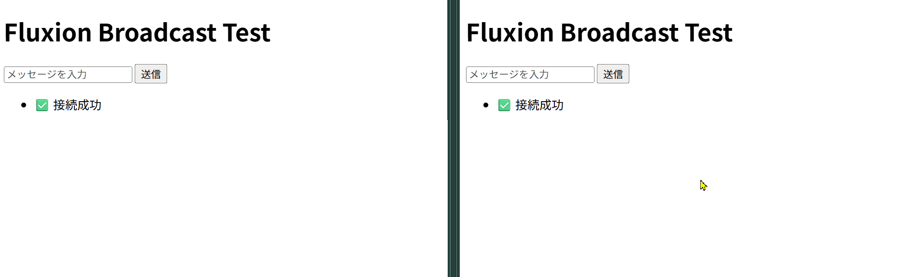

# ブロードキャストサーバーを作ろう

## システムを定義する

先に完成形を見てください。

```Rust
use ecson::prelude::*;

fn broadcast_system(
    mut ev_received: MessageReader<MessageReceived>,
    mut ev_send: MessageWriter<SendMessage>,
    client_query: Query<Entity, With<ClientId>>,
) {
    for msg in ev_received.read() {
        let NetworkPayload::Text(text) = &msg.payload else { 
            continue; 
        };

        let broadcast_text = format!("User {}: {}", msg.client_id, text);
        let payload = NetworkPayload::Text(broadcast_text);

        for target_entity in client_query.iter() {
            ev_send.write(SendMessage {
                target: target_entity,
                payload: payload.clone(),
            });
        }
    }
}
```

### 引数

1. `mut ev_received: MessageReader<MessageReceived>`:<br>
  evはイベントの略で、`ev_received`は受信したイベントを読み取るためのものとしてます。エコーサーバーの引数と同じです。
2. `mut ev_send: MessageWriter<SendMessage>`:<br>
  送るほうです。
3. `client_query: Query<Entity, With<ClientId>>`:<br>
  以下で説明します。

Ecsonは内部で`bevy_ecs`を使用しています。`Query`も`Entity`も`With`も`bevy_ecs`のものです。

|||
|---|---|
|`Query`|どのコンポーネントを持っているエンティティが欲しいかを定義する。検索窓口のようなもの。|
|`Entity`|取得したいデータの中身。Ecsonでは接続者として扱う。|
|`With`|フィルター|

つまり、`Query<Entity, With<ClientId>>`は「`ClientId`という印が付いているエンティティ」を探しています。

### ロジック

```Rust
let NetworkPayload::Text(text) = &msg.payload else { 
   continue; 
};
```

今回はTextだけ扱うので、それ以外はスルーするようにしています。

```Rust
let broadcast_text = format!("User {}: {}", msg.client_id, text);
let payload = NetworkPayload::Text(broadcast_text);
```

送信するメッセージを作っています。

```Rust
for target_entity in client_query.iter() {
   ev_send.write(SendMessage {
       target: target_entity,
       payload: payload.clone(),
   });
}
```

`ClientId`を持ったエンティティ(`Query<Entity, With<ClientId>>`)をイテレータで取り出しています。
取り出したエンティティに対して上で作ったメッセージを内容にして送信しています。

## フロントエンドからテストをしよう

先ほどと同じHTMLで構わないので、複数開いてください。
どちらかでメッセージを送信すると、自身含めて他のクライアントにも飛ぶことがわかると思います。



次回はルーム付きのチャットサーバーを作ります
