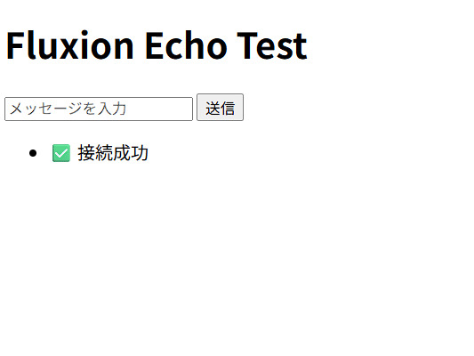

# エコーサーバーを作ろう

エコーサーバーは素早く直感的に作ることができます。

## システムを定義する

```Rust
// 頻繁に使用されるものが詰まってます
use fluxion::prelude::*;

fn echo_system(
    mut messages: MessageReader<MessageReceived>,
    mut outbound: MessageWriter<SendMessage>,
) {
    for message in messages.read() {
        outbound.write(SendMessage {
            target: message.entity,
            payload: message.payload.clone(),
        });
    }
}
```

### 引数

1. `mut messages: MessageReader<MessageReceived>`:<br>
  受け取ったメッセージ(`MessageReceived`)を読み取ります(`MessageReader`)。<br>
  `MessageReader`は内部にカーソルを持つことで「どこまで読んだか」を更新するため、`mut`を付けましょう。
2. `mut outbound: MessageWriter<SendMessage>`:<br>
  送るメッセージ(`SendMessage`)を書き込みます(`MessageWriter`)。

### ロジック

```Rust
for message in messages.read() {

}
```

`ev_received`は`MessageReader`なので`.read()`が使えます。`.read()`は、`Messages`という保管庫内の`MessageReader`が未読のメッセージを順に処理します。中身(この場合`MessageReceived`)を参照で順番に返します。

```Rust
outbound.write(SendMessage {
   target: message.entity,
   payload: message.payload.clone(),
});
```

`outbound`は`MessageWriter`なので`.write()`が使えます。`.write()`は、`Messages`という保管庫に引数に渡されたラベルを貼って書き込んでいきます。
この場合`SendMessage`という構造体を渡していますが、フィールドの`target`は送信したい相手、`payload`は内容を入れます。

### まとめ

つまり、

1. `MessageReader`で受信したメッセージを読み取り、
2. そのメッセージの情報をもとに`SendMessage`を作り、
3. `MessageWriter`でそれを返しています。

## アプリを初期化してシステムを登録しよう

```Rust
fn main() {
    FluxionApp::new()
        .add_plugins(FluxionWebSocketPlugin::new("127.0.0.1:8080"))
        .add_systems(Update, echo_system)
        .run();
}
```

上から見ていきましょう。

1. `FluxionApp::new()`<br>
  `FluxionApp`インスタンスを作ります。これがECSやネットワーク等すべてを統括しています。
2. `.add_plugins(FluxionWebSocketPlugin::new("127.0.0.1:8080"))`<br>
  `.add_plugins`でプラグインを登録します。`FluxionWebSocketPlugin`はWebSocketサーバーをFluxionに統合します。`::new("127.0.0.1:8080")`によってアドレスを*127.0.0.1:8080*で起動しています。
3. `.add_systems(Update, echo_system)`<br>
  `add_systems`でシステム(ロジック)を登録します。第一引数にはスケジュールを、第二引数にはシステムを渡します。`Update`は可能な限り毎フレーム実行します。
4. `.run();`<br>
  **実行!**

## フロントエンドからテストをしよう

```HTML
<!DOCTYPE html>
<html lang="ja">
<head>
    <meta charset="UTF-8">
    <title>echoテスト</title>
</head>
<body>
    <h1>Fluxion Echo Test</h1>
    <input type="text" id="msgInput" placeholder="メッセージを入力">
    <button onclick="sendMessage()">送信</button>
    <ul id="log"></ul>

    <script>
        const ws = new WebSocket('ws://127.0.0.1:8080');
        const log = document.getElementById('log');

        ws.onopen = () => log.innerHTML += '<li>✅ 接続成功</li>';
        
        ws.onmessage = (event) => {
            log.innerHTML += `<li>📩 サーバーから: ${event.data}</li>`;
        };

        function sendMessage() {
            const input = document.getElementById('msgInput');
            ws.send(input.value);
            log.innerHTML += `<li>📤 送信: ${input.value}</li>`;
            input.value = '';
        }
    </script>
</body>
</html>
```

サーバーを起動し、HTMLにアクセスします。

```bash
cargo run --release # 任意
```



お疲れ様でした!
次回は接続者全員に対してメッセージを送信します。
