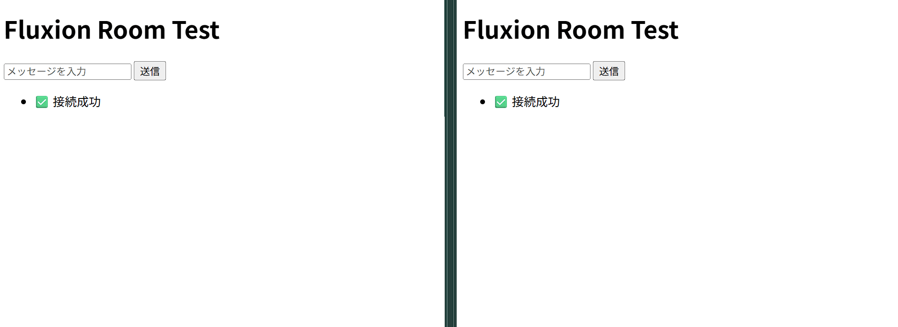

# ルーム付きサーバーを作ろう

例えば`Room(String)`というコンポーネントを作ればサクッとルーム機能が実装できます。

## コンポーネントを作ろう

`prelude`に`Component`が含まれています。

```Rust
use ecson::prelude::*;

#[derive(Component)]
struct Room(String);
```

## システムを定義しよう

一旦、ロジックは書かずに関数を作りましょう

1つめにチャットサーバーシステム本体です。

```Rust
fn chat_server_system(
    mut commands: Commands,
    mut ev_received: MessageReader<MessageReceived>,
    mut ev_send: MessageWriter<SendMessage>,
    clients: Query<(Entity, &Room)>
) {

}
```

2つめにクリーンアップシステムです。接続が切れたときにエンティティを消してみましょう。

```Rust
fn cleanup_system(
    mut commands: Commands,
    mut ev_disconnect: MessageReader<UserDisconnected>
) {

}
```

`UserDisconnected`はEcsonが提供するものです。切断されたクライアントに対応するECSエンティティや、切断されたクライアントのネットワークIDが入っています。

`Commands`は`bevy_ecs`が提供するものです。ECSは「世界」を持ちます。その中で変更処理をする際は基本的に`Commands`を介します。借用規則や並列処理、不整合をいい感じにやってくれます。

- エンティティの生成
- エンティティの削除
- コンポーネントの追加・削除
- リソースの挿入

といった操作には必ず使用してください。

## ロジックを書こう

### chat_server_system

```Rust
{
    for msg in ev_received.read() {
        let NetworkPayload::Text(text) = &msg.payload else { continue };
        let text = text.trim();

        if let Some(room_name) = text.strip_prefix("/join") {
            // --- 【入出処理】 ---
            let new_room = room_name.trim().to_string();
            commands.entity(msg.entity).insert(Room(new_room.clone()));

            ev_send.write(SendMessage {
                target: msg.entity,
                payload: NetworkPayload::Text(format!("[System] Joined: {}", new_room)),
            });
        } else if let Ok((_, room)) = clients.get(msg.entity) {
            // --- 【発言処理】 ---
            // 同じルームにいる全員を検索して送信
            for (target_entity, target_room) in clients.iter() {
                if target_room.0 == room.0 {
                    ev_send.write(SendMessage {
                        target: target_entity,
                        payload: NetworkPayload::Text(format!("[{}]: {}", room.0, text)),
                    });
                }
            } 
        }
    }
}
```

ブロック分けして解説します。

```Rust
if let Some(room_name) = text.strip_prefix("/join ") {
    // --- 【入室処理】 ---
    let new_room = room_name.trim().to_string();
    commands.entity(msg.entity).insert(Room(new_room.clone()));
    
    ev_send.write(SendMessage {
        target: msg.entity,
        payload: NetworkPayload::Text(format!("[System] Joined: {}", new_room)),
    });
} 
```

例えば「`/join rust`」というメッセージが来た時に`/join `を取り除き、`rust`という文字に加工します。それをルーム名にして、`commands.entity(msg,entity).insert(Room(new_room.clone()))`でエンティティ(すなわち接続)に`Room`コンポーネントを付与しています。

```Rust
else if let Ok((_, room)) = clients.get(msg.entity) {

}
```

`/join`から始まるメッセージ以外は、`if let Ok((_, room)) = clients.get(msg.entity)`で送ってきた接続者(`msg.entity`)が`Room`コンポーネントを持っているかを篩います。`Query`の`.get()`メソッドを使うことで、エンティティを指定してその中身をピンポイントで覗き見することができます。

```Rust
// --- 【発言処理】 ---
// 同じルームにいる全員を検索して送信
for (target_entity, target_room) in clients.iter() {
    if target_room.0 == room.0 {
        ev_send.write(SendMessage {
            target: target_entity,
            payload: NetworkPayload::Text(format!("[{}]: {}", room.0, text)),
        });
    }
}
```

`Room`コンポーネントを持っているすべてのエンティティをイテレート(`clients.iter()`)し、ルーム名が一致(`if target_room.0 == room.0`)する場合に、`ev_send.write`しています。

### cleanup_system

```Rust
for event in ev_disconnect.read() {
    if let Ok(mut ent) = commands.get_entity(event.entity) {
        ent.despawn();
    }
}
```

あとで追加する`EcsonWebSocketPlugin`はネットワークを監視しており、通信が途切れたりした瞬間に`UserDisconnected`というイベントを発行します。
これを活用し、不要なエンティティをデスポーンさせています。メモリリークを防ぐためです。

## システムを登録しよう

```Rust
fn main() {
    EcsonApp::new()
        .add_plugins(EcsonWebSocketPlugin::new("127.0.0.1:8080"))
        .add_systems(Update, (chat_server_system, cleanup_system))
        .run()
}
```

`(chat_server_system, cleanup_system)`のようにタプルで複数一気に渡すことができます。

## フロントエンドからテストをしよう

これも同じHTMLで構いません。



お疲れさまでした。
これであなたはEcsonにおけるチャットアプリ開発方法を身に付けました。
次の章では、チャットアプリを爆速で開発するためのプラグインを紹介します。
